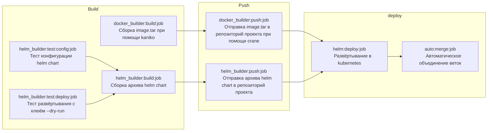

# flask-example-1

## Description
* Тестовый проект python+flask
* Приложение собирается и разворачивается при помощи gitlab ci в 3 этапа
* При условиях manual/merge/main_branch/protected_branch
  * `NS: prod`
  * `RELEASE_NAME: "${CI_PROJECT_NAME}"`
  * `CHANNEL: release`
  * `KUBE_CONTEXT: dev/kubernetes-agent-config:kubernetes-agent-prod`
  * `IMAGE_TAG: latest`
  * `INGRESS_CLASS_NAME: external-nginx`
  * `HOST: "${CI_PROJECT_NAME}.fzen.pro"`
* иначе
  * `NS: dev`
  * `RELEASE_NAME: "${CI_COMMIT_BRANCH}-${CI_PROJECT_NAME}"`
  * `CHANNEL: "${CI_COMMIT_BRANCH}"`
  * `KUBE_CONTEXT: dev/kubernetes-agent-config:kubernetes-agent-dev`
  * `IMAGE_TAG: "${CI_COMMIT_BRANCH}"`
  * `INGRESS_CLASS_NAME: internal-nginx`
  * `HOST: "${CI_COMMIT_BRANCH}.${CI_PROJECT_NAME}.fzen.pro"`
* Зависимости job

* Образ docker
  * Основан на alpine
  * Установленные утилиты:
    * python3 
    * py3-pip 
    * py3-flask
  * Запуск образа через entrypoint.sh
* helm chart
  * Тип развёртывания: Deployment
  * Поддержка tls
  * Опциональные функции:
    * service
    * ingress
    * certificate

## Dependency
* 

 Runners list. 

  | Name                                                                                                              | Default image                                         | Comment                   |
  |:------------------------------------------------------------------------------------------------------------------|:------------------------------------------------------|:--------------------------|
  | [no_tag](https://github.com/FZEN475/kubernetes-gitlab/blob/main/config/_2_runners/_1_no_tag.yaml)                 | [multitool](https://github.com/FZEN475/multitool.git) | Выполнение общих заданий. |
  | [docker_builder](https://github.com/FZEN475/kubernetes-gitlab/blob/main/config/_2_runners/_2_docker_builder.yaml) | [kaniko](gcr.io/kaniko-project/executor:debug)        | Сборка образов.           |
  | [helm](https://github.com/FZEN475/kubernetes-gitlab/blob/main/config/_2_runners/_4_helm.yaml)                     | [alpine/helm](https://hub.docker.com/r/alpine/helm)   | Доступ к kubernetes       |

  

  
* 

 Agents list. 

  
  | Name                                                                                                                                 | Namespace | Comment                                 |
  |:-------------------------------------------------------------------------------------------------------------------------------------|:----------|:----------------------------------------|
  | [kubernetes-agent-dev](https://github.com/FZEN475/kubernetes-gitlab/blob/main/config/_3_agent/_1_values_kubernetes_agent_dev.yaml)   | dev       | Имеет полные права в пространстве имён. |
  | [kubernetes-agent-prod](https://github.com/FZEN475/kubernetes-gitlab/blob/main/config/_3_agent/_2_values_kubernetes_agent_prod.yaml) | prod      | Имеет полные права в пространстве имён. |

  

* [Секреты для доступа к репозиторию проекта.](https://github.com/FZEN475/kubernetes-infra.git)